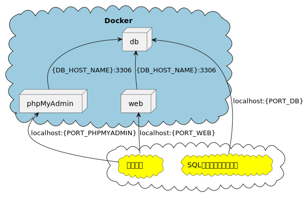

# Laravel9環境

Laravel9 のGitHubテンプレートリポジトリです。

## インストール

- Git (GitHub)
- Docker Desktop
- ターミナル (Windowsの場合、「PowerShell」, 「GitBash」等)
- VSCode (任意)
- SQLクライアント (任意 「A5:SQL Mk-2」、「DBeaver」等)

## テンプレート導入

導入は、ダウンロードするか、テンプレートからリポジトリを作成してください。

### ダウンロードする場合

「Code」から「Download ZIP」を選択するとダウンロードが可能です。

### リポジトリを作成する場合

#### リポジトリ作成

「Use this template」ボタンで、テンプレートから自身のリポジトリを作成してください。

- テンプレートからリポジトリを作成する
  - <https://docs.github.com/ja/repositories/creating-and-managing-repositories/creating-a-repository-from-a-template>

#### clone

自身で作成したリポジトリをcloneしてください。

- リポジトリをクローンする
  - <https://docs.github.com/ja/repositories/creating-and-managing-repositories/cloning-a-repository>

## 開発環境

Dockerを使って環境を構築します。  

### 構成図



### 構築する環境

- Webコンテナ
  - [php:8.1.8-apache](https://hub.docker.com/_/php)
  - [composer:2.3.10](https://hub.docker.com/_/composer)
- DBコンテナ
  - [mysql:8.0.29](https://hub.docker.com/_/mysql)
- phpMyAdminコンテナ
  - [phpmyadmin:5.2.0](https://hub.docker.com/_/phpmyadmin)

### .env

[.env](./.env)ファイルの各名称・ポート設定をしてください。  
基本的にはそのまま使用可能ですが、IPとポートが重複するとコンテナが起動しないので  
自身の環境に合わせて設定を変えてください。

### compose

以下のコマンドを実行します。

```bash
# ターミナルで実行
## ls コマンドで docker-compose.yml があるか確認
ls docker-compose.yml
## docker-compose で環境構築  ※ 時間がかかるので注意
docker-compose up -d
```

上記コマンドでエラーがなければ環境構築が完了しています。

### Laravel

Laravel関連のコマンドはDockerで用意した、WEBサーバー（コンテナ）上で行います。

```bash
# ■ Git Bashで入力
# WEBサーバーに入るコマンド
docker exec -it laravel9-web bash
```

#### composer install

```bash
# ■ WEBサーバーで入力
# 「composer.json」、「composer.lock」に記載されているパッケージをvendorディレクトリにインストール
#   ※ 時間がかかるので注意。
composer install
```

`composer install` 実行後に「`Exception`」が出ていると失敗しているので  
[root/vendor/](./root/vendor/)ディレクトリを削除して、再実行してみましょう。  
「`successfully`」が出ていれば成功です。

#### Laravel初期設定

```bash
# ■ WEBサーバーで入力
cd /var/www/root
# 「.env」ファイル
## 「.env.dev」ファイルを「.env」にコピー
cp .env.dev .env
# storage ディレクトリに読み取り・書き込み権限を与える（storage内に書き込み（ログ出力時等）に「Permission denied」のエラーが発生する）
chmod -R 777 storage/
```

### 確認

- WEB ※ ポート番号は [`.env`](./.env) の `PORT_WEB` を参照
  - <http://localhost:80/>  
    [htdocs/index.php](./htdocs/index.php)の実行結果が画面に表示されます。
- phpMyAdmin ※ ポート番号は [`.env`](./.env) の `PORT_PHPMYADMIN` を参照
  - <http://localhost:8080>

### SQLクライアント

こちらは任意です。

- `DBeaver`
  - <https://dbeaver.io/>
  - 接続情報 ※ [`.env`](./.env) の情報にあわせて設定すること
    - ドライバ名: `MySQL`
    - ServerHost: `localhost`  ～  `IP` 参照 (localhost = 127.0.0.1)
    - Port: `3306`  ～  `PORT_DB` 参照
    - Database: ※ 未入力でOK
    - ユーザー名: `root`
    - パスワード: `root`  ～  `DB_ROOT_PASSWORD` 参照
- `A5:SQL Mk-2`
  - <https://a5m2.mmatsubara.com/>
  - 接続情報 ※ [`.env`](./.env) の情報にあわせて設定すること
    - ホスト名: `localhost`  ～  `IP` 参照 (localhost = 127.0.0.1)
    - ユーザーID: `root`
    - パスワード: `root`  ～  `DB_ROOT_PASSWORD` 参照
    - ポート番号: `3306`  ～  `PORT_DB` 参照

### Laravel設定

#### 言語ファイルダウンロード

※ 以下は導入済みです  

「[`resources/lang/`](./root/resources/lang/)」に「`ja`」ディレクトリが生成され4つの言語ファイルが追加されます。  
※ 2022/07 現在、Laravel8向けの言語ファイルしか用意されていません。  
　Laravel8の言語ファイルを使う場合、Laravel9と言語ファイルの格納場所が異なるためご注意ください。  

| Laravel | 言語ディレクトリパス |
| --- | --- |
| Laravel8 | root/resources/lang/ja |
| Laravel9 | root/lang/ja |

```bash
# ■ WEBサーバーで入力
cd /var/www/root
php -r "copy('https://readouble.com/laravel/8.x/ja/install-ja-lang-files.php', 'install-ja-lang.php');"
php -f install-ja-lang.php
php -r "unlink('install-ja-lang.php');"

# Laravel9の場合、lang/ja に移動
mv resources/lang/ja/ lang/
rmdir resources/lang/
```

- auth.php言語ファイル <https://readouble.com/laravel/8.x/ja/auth-php.html>
- pagination.php言語ファイル <https://readouble.com/laravel/8.x/ja/pagination-php.html>
- passwords.php言語ファイル <https://readouble.com/laravel/8.x/ja/passwords-php.html>
- validation.php言語ファイル <https://readouble.com/laravel/8.x/ja/validation-php.html>

#### app.php

※ 以下は設定済みです  

`config/app.php` の日本設定を行います。

| Key | Value | 備考 |
| --- | :---: | --- |
| timezone | `Asia/Tokyo` | デフォルト: `UTC` |
| locale  | `ja` | デフォルト: `en` |
| fallback_locale' | `en` | デフォルト: `en`<br>locale の言語が見つからない場合に適用する言語<br>デフォルトの`en`を指定するのが良い |
| faker_locale | `ja_JP` | デフォルト: `en_US` |

#### Laravel Debugbar

※ 以下は導入済みです  

Laravelで作成した画面の下にデバッグバーが表示され、様々な情報が見れるようになります。

- GitHub
  - <https://github.com/barryvdh/laravel-debugbar>
  - Release
    - <https://github.com/barryvdh/laravel-debugbar/releases>

```bash
# ■ WEBサーバーで入力
cd /var/www/root
# composer.json にパッケージを追加し、インストールする。 「--dev」をつけることで開発環境のみに適用。
composer require --dev barryvdh/laravel-debugbar
# config/debugbar.php を追加。
php artisan vendor:publish --provider="Barryvdh\Debugbar\ServiceProvider"
```
